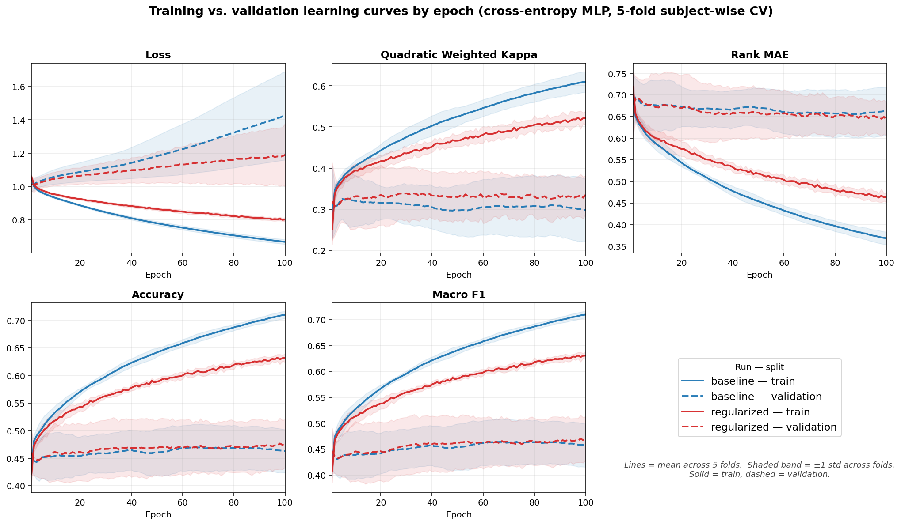

# Assignment 5

## Part A

> Scope boundary: use one main model and one focused generalization intervention. You may include a small number of additional diagnostic runs if they clarify the main result, but identify one primary intervention and do not present the work as a broad hyperparameter search. Do not run an exhaustive hyperparameter search, try many architectures without a specific diagnostic purpose, or attempt to make the model final this week.
>
> Depth expectation: this section should be evidence-first. A reader should be able to see what the model did, where it failed, what you changed, and whether the change improved trustworthiness or only changed the aggregate score.

---

> State the dataset, task, target, model being evaluated, and whether this is portfolio work or approved practice work.

I'm using the UTA Real-Life Drowsiness Dataset. It contains videos of 60 different individuals. Each individual recorded a separate video as a reference for the 3 target classes.

There are 3 target classes:

- Alert (0)
- Low Vigilant (5)
- Drowsy (10)

The 0-10 scale is based on the Karolinska Sleepiness Scale (KSS). To keep things simple in the dataset, they only had people make videos of themselves at the extreme ends and the middle of the scale.

It's an ordinal classification task because the distance from the correct label matters. Classifying someone as Alert when they're actually Drowsy should be penalized more harshly than classifying someone as Low Vigilant when they're Drowsy.

For the model on this assignment, I'm using a Cross Entropy Multi-Layer Perceptron.

This was done for the portfolio project.

---

> Use a clear train/validation/test strategy or other justified evaluation procedure.

train/validation/test strategy:

- subject-wise cross-validation
- Use `GroupKFold` (groups = `subject_id`)
- **5-fold** (12 held-out subjects per fold), or **Leave-One-Subject-Out (LOSO)** (60 folds) for the gold-standard estimate
  drowsiness papers report.

Within each training fold, carve out a few subjects (also by group) as a validation set for early stopping. Report every metric as **mean ± std across folds** — the std is the headline measure of stability with only 60 subjects.

**Optional fixed holdout** for a single clean final number: 42 train / 9 val / 9 test subjects (seeded). Touch the test split exactly once. Note that with only 9 test subjects this number is high-variance; CV is the trustworthy estimate.

**Invariant to enforce in code:** assert that the intersection of `subject_id` sets across train/val/test is empty in every fold.

---

> Explain why the split strategy is appropriate for the intended use and whether temporal, grouped, repeated-entity, or other leakage concerns affect the split.

The intended use is judging a _new_ person's alertness, so the unit of generalization is the **subject**, not the window. That makes grouped/repeated-entity leakage the dominant concern: each subject contributes ~80 highly correlated windows per video, and if any of a subject's windows landed in both train and test, the model could score well by recognizing the face rather than the alertness state. A random window-level split would do exactly that and report an inflated, dishonest number. So I split by subject with `GroupKFold` (groups = `subject_id`) so every one of a subject's windows stays on one side of the split.

Temporal leakage is not a concern here: every feature is computed from a single short window of live video, so there is no future information leaking backward. The remaining leakage risks are normalization-related and are handled outside the split — per-subject Eye Aspect Ratio (EAR) normalization uses only that subject's own frames, and the global `StandardScaler` is fit on the training fold only (see `dataset.prepare_fold_datasets`).

---

> Provide evidence for the split choice, not only a rationale. At minimum, report split counts, how the split was created, and one check that the split is plausible for the task, such as target or label distributions by split, time ranges by split, group/entity overlap checks, category coverage checks, or another task-relevant split audit.

The split was created by `splits.make_group_folds` (5-fold `GroupKFold` on `subject_id`, seed 42), with a few subjects then carved out of each training fold as a grouped validation set for tracking generalization (`splits.add_validation_subjects`). Fold assignments are saved to `folds.json` for reproducibility.

Per-fold counts (from `split_summaries.csv`) are stable across all five folds:

| Split      | Subjects | Videos | Windows (≈)  |
| ---------- | -------- | ------ | ------------ |
| Train      | 39       | 117    | ~9,500–9,700 |
| Validation | 9        | 27     | ~2,100–2,300 |
| Test       | 12       | 36     | ~2,800–3,100 |

Two audit checks confirm the split is plausible:

- **Group-overlap check:** `splits.assert_disjoint_subjects` runs on every fold and asserts the train/validation/test `subject_id` sets are disjoint. No subject appears in more than one split.
- **Label-coverage check:** the per-split label counts are near-perfectly balanced in every fold (each of label 0/1/2 is ≈1/3 of each split — e.g. fold 1 test = 923/917/954 windows). This is expected because every subject contributes exactly one video per class, so a subject-wise split is automatically class-balanced. No stratification or class weighting is needed, and the majority-class floor is therefore ≈33% accuracy / QWK ≈ 0.

---

> Report at least one task-appropriate aggregate metric, using the metric plan from Assignment 4 where feasible.

Following the Assignment 4 metric plan, the headline number is **Quadratic Weighted Kappa (QWK)**, reported at the **video level** as **mean ± std across the 5 folds**, with rank-MAE, accuracy, and macro-F1 alongside it. The std is treated as a headline result in its own right — with only 60 subjects, stability matters as much as the mean.

Video-level test results (from `metric_summary.csv`, this run is the cross-entropy MLP — the CORN head is deferred to a later stage):

| Metric   | Baseline (no regularization) | Regularized (dropout 0.25 + wd 1e-4) |
| -------- | ---------------------------- | ------------------------------------ |
| QWK      | 0.279 ± 0.145                | **0.400 ± 0.158**                    |
| rank-MAE | 0.694 ± 0.119                | **0.611 ± 0.124**                    |
| Accuracy | 0.433 ± 0.061                | **0.489 ± 0.082**                    |
| macro-F1 | 0.428 ± 0.068                | **0.483 ± 0.082**                    |

Both models clear the majority-class floor (accuracy 0.33, QWK ≈ 0), so there is signal beyond chance. But the QWK std (≈0.15) is large relative to the mean, and the two models' ± bands overlap heavily — so the regularized model _looks_ better on every metric, but on this evidence alone the gap is suggestive, not conclusive.

---

> Compare training and validation behavior using a learning curve, metric table over epochs or settings, or another clear before/after evaluation trace.

I logged train and validation metrics every epoch for all 10 runs (2 model settings × 5 folds) to W&B and to `learning_curves.csv`, trained for 100 epochs. The figure below plots the full per-epoch trace — mean across the 5 folds with a ±1 std band, solid = train, dashed = validation, blue = baseline, red = regularized:



The pattern reads straight off the curves. **Training metrics keep improving while validation flattens or reverses:** training loss falls steadily toward ≈0.67 (baseline) while validation loss bottoms out early near its starting value of ≈1.01 and then _climbs_ to ≈1.42 (baseline) / ≈1.19 (regularized) by epoch 100. The QWK panel shows the same split — train QWK rises to ≈0.6 while validation QWK plateaus around 0.30 — and accuracy and macro-F1 tell the identical story. The widening gap between each solid and dashed pair _is_ the overfitting, and the textbook upward turn in validation loss is exactly what the intervention is meant to close.

Two things are visible epoch by epoch that a final-number table would hide: the red (regularized) train/validation pairs sit consistently closer together than the blue (baseline) pairs — the intervention narrowing the gap throughout training, not just at the end — and the validation curves stop improving long before epoch 100, which is direct evidence that fixed-epoch training without early stopping is leaving generalization on the table.

For the record, the mean-across-folds values at the final epoch (epoch 100), which are the right-hand endpoints of the curves above:

|             | train loss | val loss | train QWK | val QWK | train acc | val acc |
| ----------- | ---------- | -------- | --------- | ------- | --------- | ------- |
| Baseline    | 0.669      | 1.424    | 0.609     | 0.298   | 0.710     | 0.463   |
| Regularized | 0.803      | 1.190    | 0.521     | 0.335   | 0.632     | 0.477   |

---

> When feasible, include both training and validation metrics over epochs. A final metric table alone is not enough to diagnose overfitting or underfitting.

Both are included above — the per-epoch figure plus the final-epoch table — with the underlying values in `learning_curves.csv` / the W&B `train/*` and `validation/*` panels. The contrast between the two is exactly the point: the final-epoch table alone shows the regularized model ends _better_, but it can't show _why_, and read in isolation its rising validation loss could even look like a worse model. Only the epoch-by-epoch curves reveal that the baseline's validation loss is actively degrading as training continues and that both models stop improving well before epoch 100 — diagnosis that a single end-of-training table would hide, and direct evidence that fixed-epoch training without early stopping is leaving generalization on the table (more on that in the intervention section).

---

> Diagnose whether the evidence suggests overfitting, underfitting, plausible generalization, leakage risk, unstable validation behavior, or insufficient evidence.

The dominant diagnosis is **overfitting**, plus **unstable validation behavior** across folds:

- **Overfitting:** train loss ≫ improves while validation loss rises (baseline 0.67 vs 1.42), and train QWK (0.61) is roughly double validation QWK (0.30). The model is memorizing the 39 training subjects faster than it generalizes.
- **Unstable validation:** per-fold test QWK ranges from 0.16 (fold 3) to 0.49–0.62 (fold 2) for the same model. With only 12 test subjects per fold this fold-to-fold swing is large, which is exactly why mean ± std (not a single number) is the honest report.
- **Not leakage:** if subject leakage were present, scores would be near-ceiling, not stuck at QWK ≈ 0.3–0.4 with high variance. The modest, noisy numbers are themselves evidence the subject-wise split is doing its job.
- **Not underfitting:** the model clearly _can_ fit the training set (train QWK 0.61, train acc 0.71) — the problem is the train→validation gap, not capacity.

So: plausible-but-fragile generalization, limited by overfitting and small-n instability rather than by leakage or lack of capacity.

---

> Apply at least one generalization technique such as weight decay, dropout, early stopping, data augmentation where appropriate, model simplification, reduced features, or another justified constraint.

The primary generalization intervention is **regularization: dropout (p = 0.25) added between the hidden layers, plus L2 weight decay (1e-4) on the Adam optimizer**. Everything else is held fixed — same `(64, 32)` architecture, same features, same learning rate, same 5 folds, same seeds — so the two runs are a clean A/B and any difference is attributable to the regularization (defined in `train.py`'s `model_runs` dict). This is the right intervention to try first because the diagnosis was overfitting, not underfitting or leakage, and dropout + weight decay attack the train→validation gap directly without adding capacity or new data.

---

> Compare behavior before and after the intervention and explain what changed.

The intervention helped on every aggregate, and — more importantly — it narrowed the overfitting gap rather than just nudging the score:

- **Train→validation gap shrank.** Training fit got _weaker_ (train QWK 0.61 → 0.52, train loss 0.67 → 0.80) while validation got _better_ (val QWK 0.30 → 0.34, val loss 1.42 → 1.19). The model is being stopped from memorizing, which is the intended mechanism.
- **Video-level test improved.** QWK 0.279 → 0.400, rank-MAE 0.694 → 0.611, accuracy 0.433 → 0.489, macro-F1 0.428 → 0.483.
- **Errors got less severe.** Summed-over-folds confusion shows the worst (off-by-two) alert→drowsy errors halved, 12 → 6 (see below).

What did **not** change: the across-fold std stayed high (QWK std ≈0.15 in both), and validation loss still drifts upward late in training. So regularization reduced overfitting but did not eliminate it — it points clearly at **early stopping on validation QWK** as the next, complementary constraint (the spec already calls for patience-based stopping; this run used a fixed 100 epochs, so the reported numbers are likely a floor).

---

> Analyze errors by examples, subgroup, slice, condition, time period, source, class, target range, or another task-relevant dimension.

The most task-relevant slice is the **true class / ordinal position**, because the whole point of the ordering is that alert↔drowsy confusions are worse than adjacent ones. Confusion matrices summed over all 5 folds (rows = true, columns = predicted; 60 videos per class):

```
Baseline                         Regularized
          pred a  l  d                     pred a  l  d
true alert   25 23 12             true alert   34 20  6
true low     18 23 19             true low     21 21 18
true drowsy  11 19 30             true drowsy  12 15 33
```

Reading the errors (`error_by_true_label.csv` confirms):

- **Off-by-two corners are the real failure, and regularization helped most there.** Alert→drowsy dropped 12 → 6 and alert recall rose 25 → 34 of 60 (per-class accuracy 0.42 → 0.57, rank-MAE 0.78 → 0.53). The single biggest improvement is the model no longer calling alert people drowsy nearly as often.
- **The middle class (low-vigilant) is hardest for both models** (accuracy ≈0.35), which is expected: it sits between the two extremes and its errors spill almost evenly to alert and drowsy. Encouragingly, those are mostly _adjacent_ (off-by-one) errors, so its rank-MAE stays moderate (≈0.65).
- **Drowsy is recognized most reliably** (accuracy ≈0.50–0.55) — the safest direction for an early-warning aid to be good at, though drowsy→alert off-by-two errors (11–12) are the remaining dangerous cases to drive down.

---

> Evaluate calibration or confidence behavior when appropriate for the task. If calibration is not appropriate, briefly explain why.

Calibration is appropriate here because an early-warning aid would act on a confidence threshold, so I checked whether the softmax max-probability separates correct from incorrect video-level predictions (`confidence_by_correctness.csv`):

| Run         | mean confidence (correct) | mean confidence (incorrect) | gap   |
| ----------- | ------------------------- | --------------------------- | ----- |
| Baseline    | 0.607 (n=78)              | 0.512 (n=102)               | 0.095 |
| Regularized | 0.554 (n=88)              | 0.481 (n=92)                | 0.073 |

The model is **only weakly able to tell when it's right**: confidence on correct predictions is barely higher than on wrong ones (gap < 0.10), and with 3-class argmax the floor is 0.33, so a mean of ~0.5 means it is broadly uncertain. Regularization pulled confidence _down_ overall (less overconfident, which is good) but also slightly shrank the correct/incorrect gap. The takeaway is that **raw softmax confidence is not yet a trustworthy gate** for this model — a proper calibration step (temperature scaling, or a reliability-diagram check) and possibly the CORN cumulative probabilities are needed before any confidence threshold could drive a warning.

## Part B

> Your writeup should include a short trace from at least three Assignment 4 audit risks, assumptions, or success criteria to the Week 5 evidence you collected.

Assignment 4 documented portfolio risks:

```md
## Prediction-time availability and leakage risks

Every model feature is computable from a single window of live video at inference time, so there is **no temporal/feature leakage from the future**. The risks that _do_ matter here are identity and normalization leakage:

- **Subject leakage (the dominant risk):** windows from one person are highly correlated; if any of a subject's windows land in both train and test, the model recognizes the _face_, not the _state_. **Mitigation:** all splits are **subject-wise** (GroupKFold / LOSO on `subject_id`), with a coded assertion that train/val/test subject sets are disjoint in every fold.
- **Per-subject normalization leakage:** baseline EAR differs by face. Per-subject normalization stats are computed from **that subject's own frames only** (across all 3 of their videos), so nothing crosses between subjects — safe in any fold. Crucially, **the alert video is never used as a per-subject baseline**, because that baseline would not exist at deployment time.
- **Global scaling leakage:** the `StandardScaler` is fit on the **training fold only**, then applied to val/test.
- **Appearance/lighting leakage:** addressed by design (geometric features, not pixels) and _empirically checked_ via the luminance-only baseline.
```

Three of those risks trace directly to Week 5 evidence:

1. **Subject leakage (the dominant risk) → subject-wise split + coded disjointness assertion.** `splits.assert_disjoint_subjects` runs on every fold and `split_summaries.csv` shows the 39/9/12-subject split with no overlap. The fact that test QWK sits at a modest, high-variance 0.3–0.4 (rather than near-ceiling) is corroborating evidence that no subject leakage is inflating the score.
2. **Class-balance assumption → label-coverage audit.** The assumption that "every subject contributes one video per class, so any subject-wise split is balanced" is confirmed: each split's label counts are ≈1/3 each in all five folds.
3. **Global scaling leakage → train-only scaler.** The `StandardScaler` is fit on the training fold only inside `dataset.prepare_fold_datasets`, so val/test statistics never inform preprocessing.

---

> Your writeup should include which risks or assumptions were confirmed, reduced, contradicted, newly discovered, or still untested.

- **Confirmed / handled:** subject leakage (disjoint folds enforced and consistent with the modest scores), class balance (audited per fold), and train-only scaling. The Assignment 4 assumption that the geometric features carry _some_ real alertness signal is also confirmed — both models clear the majority floor.
- **Reduced:** overfitting. It is real (train QWK 0.61 vs val 0.30) but the regularization intervention measurably narrowed the gap and improved every video-level metric.
- **Newly discovered:** (a) **high fold-to-fold instability** — per-fold QWK swings from 0.16 to 0.62, so with n=60 the std is a first-class result, not a footnote; (b) **weak confidence calibration** — softmax max-prob barely separates correct from incorrect predictions, so confidence can't yet gate a warning.
- **Still untested (the important gap):** the **lighting/luminance confound** and the **PERCLOS-only** reference. The Stage 0 baselines (majority is covered analytically, but luminance-only and PERCLOS-only) are **not yet implemented** — there is no `baselines.py` in the repo. So the central Assignment 4 claim — "if the model doesn't beat the luminance baseline, it's a brightness detector" — remains unverified. The CORN ordinal head and LOSO are also still untested.

---

> Your writeup should include whether the model is reliable enough for the intended use at this stage.

**No — and it isn't meant to be yet; this is an initial candidate, not a recommendation.** It shows genuine signal beyond chance (beats the majority floor on accuracy and QWK), and the regularized version reduces the most dangerous alert↔drowsy errors. But three things block any reliability claim: (1) the QWK ± bands are wide and overlap between models, so I can't yet say the gain is real; (2) the lighting confound is untested, so I can't yet rule out that part of the signal is brightness, not alertness; and (3) confidence is poorly calibrated, so the model can't honestly say when it's unsure. For the charter's _personal_ use case this is promising early evidence; for anything client-facing or safety-adjacent it's not at all close.

---

> Your writeup should include what additional evidence would be needed before deployment or client-facing recommendation.

In rough priority order:

1. **Run the Stage 0 baselines** — especially luminance-only (the confound check) and PERCLOS-only — under the same subject-wise CV, and show the model beats them with non-overlapping bands. This is the single most important missing piece.
2. **Add early stopping on validation QWK** (the spec's patience-based rule) so the reported numbers aren't depressed by fixed-epoch overfitting, and re-report.
3. **Escalate to LOSO (60 folds)** for the gold-standard, lower-variance generalization estimate the charter promised.
4. **Calibrate confidence** (temperature scaling + reliability diagram) and re-check the correct/incorrect separation.
5. **Subgroup error slices** (glasses / facial-hair / gender) where sample size permits, to surface the cohort-skew representativeness limits flagged in Assignment 4.
6. **A/B the CORN ordinal head** vs cross-entropy, as planned, to see whether the ordinal loss earns its place on the dangerous off-by-two errors.

---

> Your writeup should include how this evidence should guide the next staged portfolio model improvement.

This maps cleanly onto the charter's **Stage 2** ("revised model or justified simpler alternative"): the Week 5 evidence says the _first_ thing to do is not a fancier model but to **finish the floors and the honest evaluation scaffolding** — implement `baselines.py`, add early stopping, and move to LOSO — because right now I can't tell whether the model beats a brightness detector. Only after that does the model-vs-model work make sense: A/B CORN against cross-entropy and ablate the full feature set against PERCLOS-only. The regularization result also sets a concrete expectation — the next model has to beat regularized QWK ≈ 0.40 with _tighter_ fold bands, not just a higher mean. And if CORN or the full feature set turns out statistically indistinguishable from the simpler option, the charter says to keep the simpler one and report it — the high std observed here means I should hold that bar honestly.

---

> Your writeup should include if you used a practice model, a short note explaining which parts of the evaluation process transfer directly to your portfolio project and which parts still need portfolio-specific evidence.

Not applicable — this is portfolio work on the UTA-RLDD dataset, not the NYC TLC practice model, so the whole evaluation is portfolio-specific.
